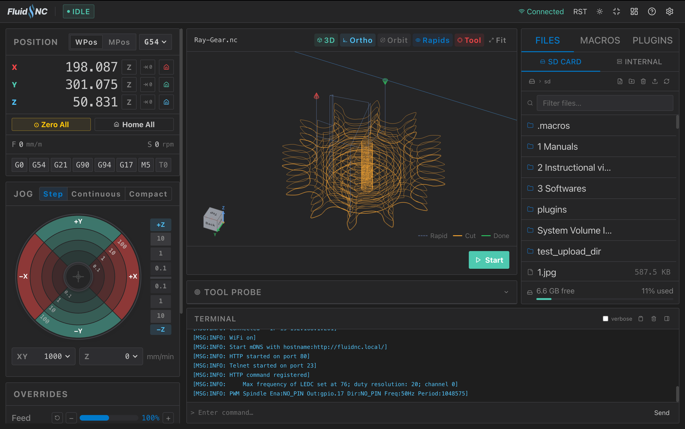
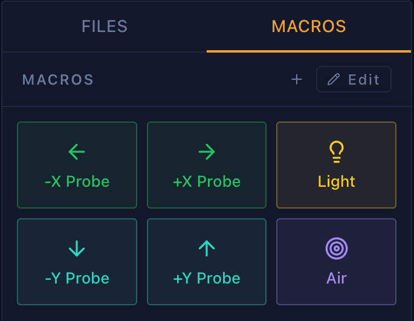
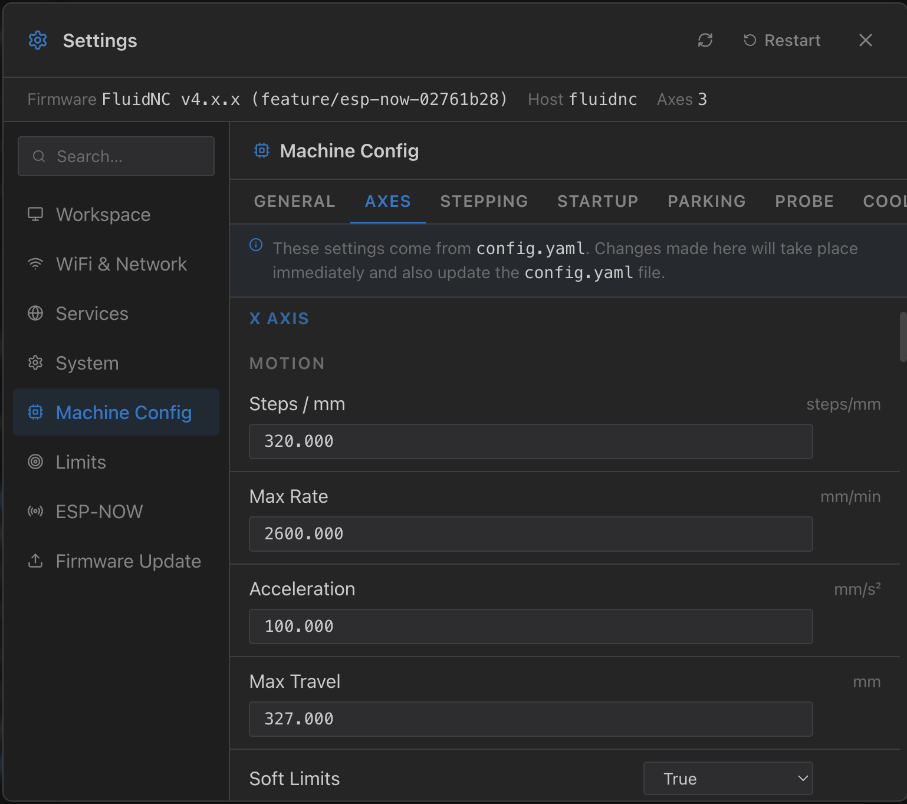
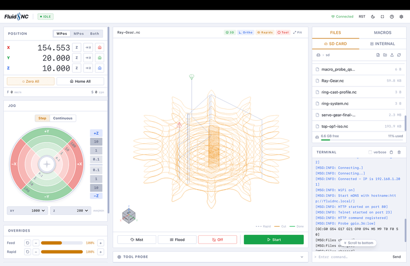
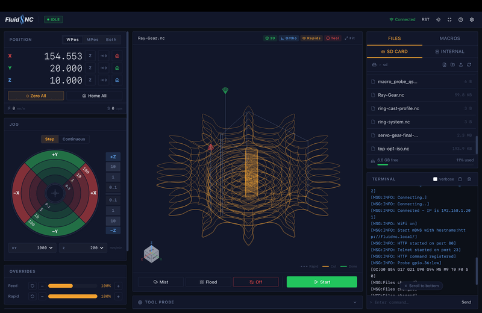
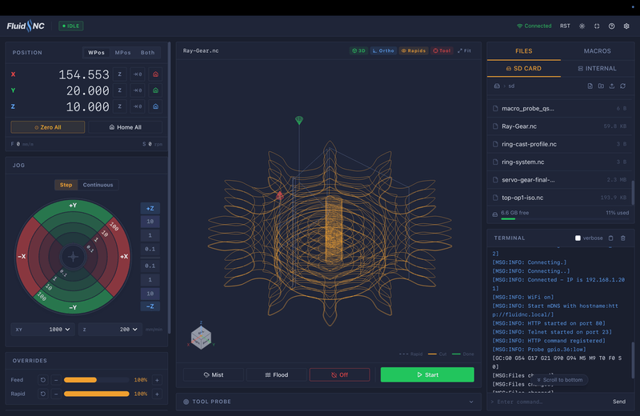
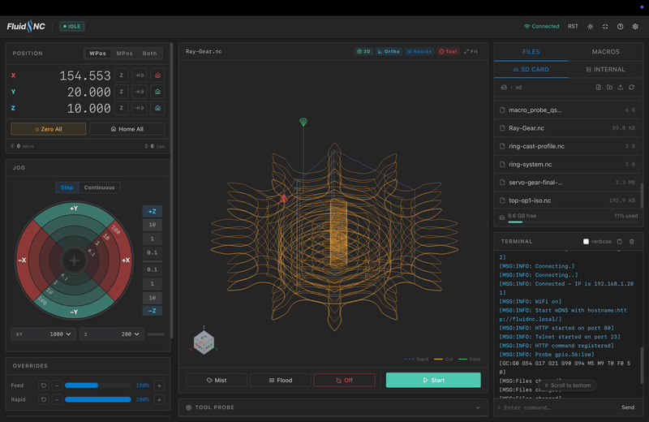
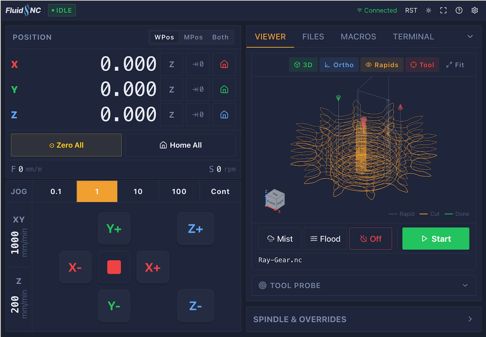
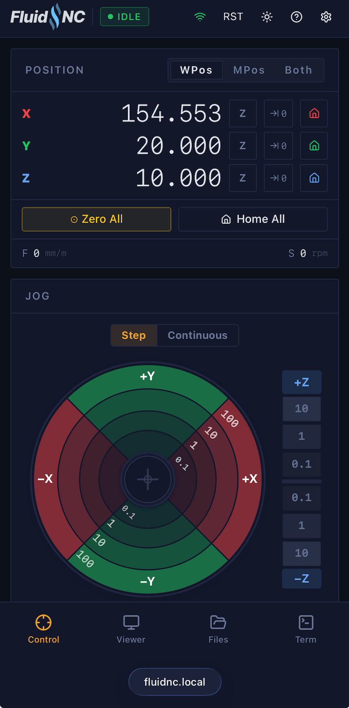

# FigUI

A modern web-based interface built with React & Typescript for [FluidNC](https://github.com/bdring/FluidNC), the ESP32-based CNC controller firmware. FigUI is designed as a drop-in replacement for the legacy WebUIs, offering a more capable and responsive experience across desktop, tablet, and mobile devices.

**[Try the live demo](https://figamore.github.io/FigUI/)** - no hardware needed, runs a simulated machine in the browser.

---

## Table of Contents

- [Overview](#overview)
- [Features](#features)
  - [Digital Readout (DRO)](#digital-readout-dro)
  - [Jogging](#jogging)
  - [G-Code Viewer](#g-code-viewer)
  - [Job Control](#job-control)
  - [Spindle Control](#spindle-control)
  - [File Manager](#file-manager)
  - [Code Editor](#code-editor)
  - [Macros](#macros)
  - [Settings](#settings)
  - [Unit Support](#unit-support)
  - [Themes](#themes)
  - [Responsive Layouts](#responsive-layouts)
- [Plugin API](#plugin-api)
- [Deployment](#deployment)
- [Tech Stack](#tech-stack)
- [License](#license)

---

## Overview

FigUI connects to your FluidNC controller over WebSocket and HTTP, providing real-time machine control, job management, file operations, and configuration.



---

## Features

### Digital Readout (DRO)

The DRO displays live axis positions in both work coordinates (WPos) and machine coordinates (MPos). It supports machines with three to six axes (X, Y, Z, A, B, C).

- Zero any axis independently or all at once
- "Go to zero" buttons for each axis
- Home all axes or individual axes
- Live feed rate and spindle RPM display

---

### Jogging

The jog pad offers two modes:

- **Step jog** - A ring-based interface where each press moves the axis by a configured increment. Step sizes are selectable per axis.
- **Continuous jog** - Hold to move; the machine jogs at the set feed rate for as long as the button is held.

Keyboard jogging is supported: arrow keys for X/Y, `+`/`-` for Z. Feed rates for XY, Z, and rotary axes are configured independently and saved to local storage between sessions.

---

### G-Code Viewer

A 3D toolpath viewer renders the loaded G-code file using WebGL. It provides a spatial overview of the job before and during execution.

> [!Info]
> For very large G-code files, toolhead progress tracking is intentionally disabled. Rendering a live toolhead position on a dense toolpath is expensive and may degrade responsiveness.

---

### Job Control

While a job is running from the SD card or internal storage, the job control panel shows:

- Play / Resume
- Feed hold (pause)
- Abort
- Job progress as a percentage

---

### Spindle Control

The spindle panel provides direct RPM input, quick-select preset buttons (6K, 12K, 18K, 24K RPM), and start/stop controls. The current spindle state and override percentage are displayed alongside the controls.

---

### File Manager

The file manager gives access to both the SD card and the ESP32 internal filesystem:

- Browse directories and files
- Upload files with a live progress indicator
- Download files to the local machine
- Delete files and directories
- Rename files
- Create new directories
- Open text-based files (G-code, configuration) in the built-in code editor

---

### Code Editor

Text files stored on the controller can be opened and edited directly in the browser. The editor includes syntax highlighting and saves changes back to the controller filesystem.

---

### Macros

Macros are custom one-click buttons that send a sequence of G-code or FluidNC commands to the controller. Macros can be created from scratch using the built-in editor or point to a file in the SD or internal filesystem.

Macros are saved to controller storage so they persist across sessions and devices.




---

### Settings

The settings panel allows full configuration of the FluidNC host over HTTP and is fully searchable. Device information (firmware version, hostname, IP address) is displayed alongside editable settings organized by category, including network, WiFi, axes, limits, and services.




---

### Unit Support

The interface operates in either millimeters or inches. The preference is saved to local storage and applied across all position displays, feed rate inputs, and jog calculations.

---

### Themes

Four built-in themes are available and can be switched at any time:

<table>
  <tr>
    <td align="center"><b>Light</b><br/></td>
    <td align="center"><b>Dark</b><br/></td>
  </tr>
  <tr>
    <td align="center"><b>Anthracite Dark</b><br/></td>
    <td align="center"><b>Midnight Dark</b><br/></td>
  </tr>
</table>

The selected theme persists to local storage.

---

### Responsive Layouts

Tablet Layout


Mobile Layout


---

## Plugin API

FigUI supports custom plugins - self-contained HTML files that run inside sandboxed iframes with access to machine control, file I/O, and UI theme integration.

**[Plugin Developer Guide →](plugins/PLUGIN_GUIDE.md)**

---

## Deployment

Build the project and copy the output to the controller's filesystem:

```bash
npm install
npm run build:esp32
```

The `dist/` directory contains the static index.html.gz file you can upload to the internal filesystem of the ESP32. Simply refresh the page to show changes.

---

## License

GPLv3
