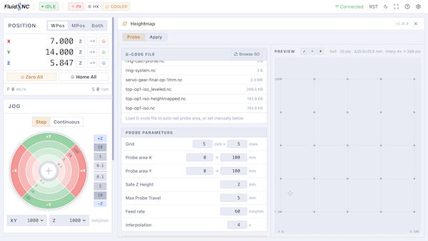
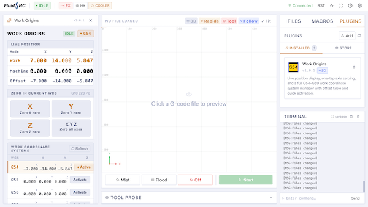
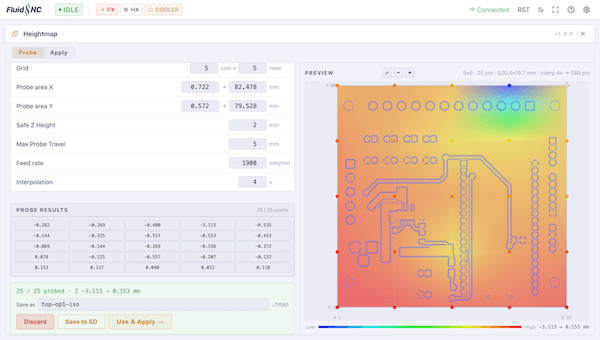

# FigUI Plugin Developer Guide

Plugins are self-contained HTML files that run inside FigUI and can communicate with your FluidNC machine. They live in sandboxed iframes, inherit the UI theme automatically, and can be installed on internal storage or SD card.

---

## Table of contents

- [Plugin structure](#plugin-structure)
- [plugin.json](#pluginjson)
- [Layout modes](#layout-modes)
  - [default (floating window)](#default-floating-window)
  - [workspace](#workspace)
  - [controls](#controls)
  - [full](#full)
  - [Responsive overrides](#responsive-overrides)
- [Theme](#theme)
  - [Available variables](#available-variables)
- [API](#api)
  - [getStatus](#getstatus)
  - [sendCommand](#sendcommand)
  - [sendQuery](#sendquery)
  - [subscribe / unsubscribe](#subscribe--unsubscribe)
  - [readFile](#readfile)
  - [writeFile](#writefile)
  - [listFiles](#listfiles)
  - [getDeviceInfo](#getdeviceinfo)
  - [getSettings / saveSettings](#getsettings--savesettings)
- [Minimal example](#minimal-example)
- [Installing a plugin](#installing-a-plugin)
- [Publishing to the store](#publishing-to-the-store)
- [Tips](#tips)

---

## Plugin structure

A plugin is a folder with two required files:

```
my-plugin/
├── plugin.json   ← manifest (required)
└── index.html    ← entry point (required)
```

Additional assets (CSS files, images, JS files) can be placed in the same folder and referenced with relative paths — FigUI sets the `<base>` URL to your plugin's folder automatically. Subdirectories are not supported — keep everything flat.

```
my-plugin/
├── plugin.json
├── index.html
├── style.css     ← link with <link rel="stylesheet" href="style.css">
└── icon.png
```

---

## plugin.json

```json
{
  "name": "My Plugin",
  "description": "What it does, in one sentence.",
  "version": "1.0.0",
  "entry": "index.html",
  "icon": "icon.png"
}
```

| Field | Required | Description |
|---|---|---|
| `name` | ✅ | Display name shown in the plugin list |
| `description` | No | Short description shown below the name |
| `version` | No | Shown as a small badge (e.g. `v1.0.0`) |
| `entry` | No | Entry HTML file. Defaults to `index.html` |
| `icon` | No | Icon image filename. Recommended size: **48×48 px**. Must be `icon.png` for store submissions. |
| `layout` | No | How the plugin is embedded in the UI. One of `"default"`, `"workspace"`, `"controls"`, `"full"`. Omit for the standard floating window. See [Layout modes](#layout-modes). |
| `layoutTablet` | No | Layout override for tablet screens. See [Responsive overrides](#responsive-overrides). |
| `layoutMobile` | No | Layout override for mobile screens. See [Responsive overrides](#responsive-overrides). |
| `files` | No | List of files to download when installing from the store. If omitted, only `entry` and `icon` are fetched. **Required if you have additional assets** (e.g. `style.css`). |

Example with a stylesheet:

```json
{
  "name": "My Plugin",
  "entry": "index.html",
  "icon": "icon.png",
  "files": ["index.html", "style.css", "icon.png"]
}
```

---

## Layout modes

Set the `layout` field in `plugin.json` to control how your plugin is embedded in the UI. Omitting `layout` (or setting it to `"default"`) opens the plugin as a floating window.

### default (floating window)

The plugin opens as a draggable, resizable floating panel on top of the main UI. All standard UI elements remain visible and usable behind it. Best for tools that need to be referenced alongside the normal workflow — overlays, quick calculators, status displays.

```json
{ "layout": "default" }
```


---

### workspace

The plugin takes the **center and right area** of the layout, replacing the G-code viewer and file manager. The DRO, jog controls, and machine status remain visible on the left. Use this for tools that need a large canvas but still benefit from the DRO being accessible — heightmap probing, toolpath editors, camera views.

```json
{ "layout": "workspace" }
```

 

---

### controls

The plugin takes the **left column**, replacing the DRO and jog controls. The G-code viewer and file manager remain visible on the right. Use this for plugins that provide their own motion controls or machine-state UI and don't need the standard jog interface.

```json
{ "layout": "controls" }
```

 

---

### full

The plugin takes the **entire content area** below the header, hiding all other UI elements. Use this for immersive tools that manage their own navigation — setup wizards, full-screen viewers, configuration editors.

```json
{ "layout": "full" }
```

 

---

### Responsive overrides

Use `layoutTablet` and `layoutMobile` to switch layout modes based on screen size. The base `layout` field is used for desktop and as the fallback for any size not explicitly overridden.

```json
{
  "layout": "workspace",
  "layoutTablet": "full",
  "layoutMobile": "full"
}
```

| Field | Applies when |
|---|---|
| `layout` | Desktop, and any size without a specific override |
| `layoutTablet` | Tablet-sized screens |
| `layoutMobile` | Mobile-sized screens |

---

## Theme

FigUI injects its CSS custom properties into your plugin's `:root` automatically. Use them directly — no setup needed.

```css
body {
  background: var(--bg);
  color: var(--text-primary);
  font-family: ui-sans-serif, system-ui, sans-serif;
}
```

### Available variables

| Variable | Use |
|---|---|
| `--bg` | Page background |
| `--surface` | Card / panel background |
| `--elevated` | Slightly lighter surface |
| `--border` | Default border |
| `--border-strong` | Emphasized border |
| `--accent` | Primary accent (orange) |
| `--accent-hover` | Accent hover state |
| `--text-primary` | Main text |
| `--text-muted` | Secondary text |
| `--text-dim` | Hint / placeholder text |
| `--ok` | Green — success |
| `--warn` | Yellow — warning |
| `--danger` | Red — error / destructive |
| `--info` | Blue — informational |
| `--purple` | Purple |
| `--teal` | Teal |

Theme changes (light/dark switch) are pushed to your plugin automatically via `postMessage` — no action needed on your end.

---

## API

Plugins communicate with FigUI via `postMessage`. A simple request/response helper:

```js
let msgId = 0
const pending = {}

function call(method, params) {
  return new Promise((resolve, reject) => {
    const id = String(++msgId)
    pending[id] = { resolve, reject }
    window.parent.postMessage(
      { type: 'fluid-request', id, method, params: params ?? {} }, '*'
    )
  })
}

window.addEventListener('message', e => {
  if (e.data?.type === 'fluid-response') {
    const p = pending[e.data.id]
    if (p) {
      delete pending[e.data.id]
      e.data.error ? p.reject(new Error(e.data.error)) : p.resolve(e.data.result)
    }
  }
})
```

### Methods

#### `getStatus`
Returns the current machine status snapshot.

```js
const status = await call('getStatus')
// status.state    → 'Idle' | 'Run' | 'Hold' | 'Alarm' | ...
// status.wpos     → { x, y, z, a?, b?, c? }
// status.mpos     → { x, y, z, a?, b?, c? }
// status.feed     → number (mm/min)
// status.spindle  → number (rpm)
// status.feedOverride    → number (%)
// status.rapidOverride   → number (%)
// status.spindleOverride → number (%)
```

#### `sendCommand`
Sends a G-code command via WebSocket. Fire-and-forget — no response data.

```js
await call('sendCommand', { command: 'G0 X0 Y0' })
await call('sendCommand', { command: 'G10 L20 P0 X0 Y0 Z0' })
```

Use this for all motion commands and G-code execution.

#### `sendQuery`
Sends a command via HTTP and returns the response text. Use for commands that return data.

```js
const result = await call('sendQuery', { command: '$$' })   // settings dump
const offsets = await call('sendQuery', { command: '$#' })  // coordinate offsets
const modes   = await call('sendQuery', { command: '$G' })  // parser state
```

#### `subscribe` / `unsubscribe`
Subscribe to live events. Two events are available: `'status'` and `'line'`.

**`status`** — fires whenever the machine status changes (same shape as `getStatus`):

```js
await call('subscribe', { event: 'status' })

window.addEventListener('message', e => {
  if (e.data?.type === 'fluid-event' && e.data.event === 'status') {
    render(e.data.data)
  }
})

await call('unsubscribe', { event: 'status' })
```

**`line`** — fires for every raw line received from the machine over the WebSocket:

```js
await call('subscribe', { event: 'line' })

window.addEventListener('message', e => {
  if (e.data?.type === 'fluid-event' && e.data.event === 'line') {
    console.log('machine says:', e.data.data)   // e.g. "ok", "<Idle|WPos:0,0,0>"
  }
})

await call('unsubscribe', { event: 'line' })
```

#### `readFile`
Read a file from the device filesystem. Returns the file contents as a string.

```js
const content = await call('readFile', { path: '/config.yaml' })
const sdFile  = await call('readFile', { path: '/sd/data.txt', fs: 'sd' })
```

| Param | Default | Description |
|---|---|---|
| `path` | — | Full file path |
| `fs` | `'local'` | `'local'` for internal flash, `'sd'` for SD card |

#### `writeFile`
Write a string to a file on the device filesystem.

```js
await call('writeFile', { path: '/output.txt', content: 'Hello!' })
await call('writeFile', { path: '/sd/log.txt', content: data, fs: 'sd' })
```

| Param | Default | Description |
|---|---|---|
| `path` | — | Full file path |
| `content` | — | String content to write |
| `fs` | `'local'` | `'local'` or `'sd'` |

#### `listFiles`
List files in a directory.

```js
const result = await call('listFiles', { path: '/sd' })
// result.files  → [{ name, size, isDir }, ...]
// result.total  → total bytes on filesystem
// result.used   → used bytes
```

| Param | Default | Description |
|---|---|---|
| `path` | `'/'` | Directory path |
| `fs` | `'local'` | `'local'` or `'sd'` |

#### `getDeviceInfo`
Returns ESP32 device information.

```js
const info = await call('getDeviceInfo')
// info.version    → firmware version string
// info.hostname   → device hostname
// info.axes       → number of axes
// info.wsPort     → WebSocket port
// info.primarySd  → primary SD path
```

#### `getSettings` / `saveSettings`
Per-plugin persistent settings, stored on the device. Each plugin gets its own namespace — data is never shared between plugins.

```js
// Load saved settings (returns {} if none saved yet)
const settings = await call('getSettings')

// Save settings (any JSON-serializable object)
await call('saveSettings', { data: { speed: 100, units: 'mm' } })
```

Settings are stored at `/plugins/<plugin-id>/settings.json`, co-located with the plugin files. They are automatically removed when the plugin is deleted.

---

## Minimal example

```html
<!DOCTYPE html>
<html lang="en">
<head>
<meta charset="UTF-8">
<style>
  body { background: var(--bg, #0c1018); color: var(--text-primary, #e2e6f4);
         font-family: ui-sans-serif, system-ui, sans-serif; padding: 20px; }
  #state { font-size: 32px; font-weight: 700; color: var(--accent, #f0a030); }
</style>
</head>
<body>
  <div id="state">—</div>

  <script>
    let msgId = 0
    const pending = {}

    function call(method, params) {
      return new Promise((resolve, reject) => {
        const id = String(++msgId)
        pending[id] = { resolve, reject }
        window.parent.postMessage({ type: 'fluid-request', id, method, params: params ?? {} }, '*')
      })
    }

    window.addEventListener('message', e => {
      if (e.data?.type === 'fluid-response') {
        const p = pending[e.data.id]
        if (p) { delete pending[e.data.id]; e.data.error ? p.reject(new Error(e.data.error)) : p.resolve(e.data.result) }
      }
      if (e.data?.type === 'fluid-event' && e.data.event === 'status') {
        document.getElementById('state').textContent = e.data.data.state
      }
    })

    call('subscribe', { event: 'status' })
    call('getStatus').then(s => { document.getElementById('state').textContent = s.state })
  </script>
</body>
</html>
```

---

## Installing a plugin

### From folder
In FigUI → Plugins tab → **Add** → choose storage location → select your plugin folder. FigUI uploads all files automatically.

### On the device directly
Copy the plugin folder to `/plugins/` on internal storage or `/sd/plugins/` on SD card. Then hit the refresh button in the Plugins tab.

---

## Publishing to the store

1. Fork the FigUI repository
2. Add your plugin folder under `plugins/your-plugin-id/`
3. Add an entry to `plugins/registry.json`:

```json
{
  "id": "your-plugin-id",
  "name": "Your Plugin Name",
  "description": "What it does.",
  "version": "1.0.0",
  "author": "your-github-username",
  "base": "https://raw.githubusercontent.com/figamore/FigUI/main/plugins/your-plugin-id/"
}
```

4. Open a pull request

Once merged, your plugin appears in the store for all FigUI users.

> **Store requirements:** Low-effort plugins that don't add much value or PRs without a 48×48 `icon.png` will be rejected. Please ensure icons are your own work and not copyrighted.

---

## Tips

- **Use `sendCommand` for motion, `sendQuery` for data.** `sendCommand` goes through the WebSocket queue (same as the terminal), `sendQuery` uses HTTP and returns the response.
- **Check connection state.** If the machine is not connected, `sendCommand` and `sendQuery` will reject with `"Not connected"`.
